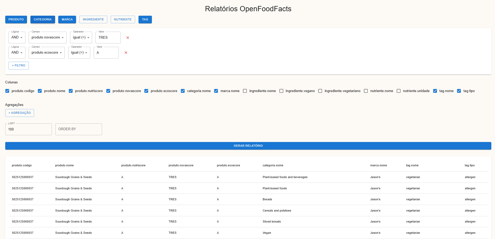

# Interface Web para Geração de Relatórios

Este projeto é a interface frontend da aplicação de geração de relatórios ad hoc. Desenvolvido em **React** com **Vite**, ele se comunica com o backend (disponível em outro repositório) para permitir que o usuário configure filtros, selecione colunas e visualize os resultados.

> **Importante:** este projeto **depende do backend** para funcionar corretamente. Verifique se o backend está rodando localmente ou configurado em ambiente de produção antes de iniciar o frontend. Subistitua URL_BASE em api.js para a URL do backend local!

Veja em https://github.com/Erick-Bonifacio/relatorio-adhoc-bdII

---

## Pré-requisitos

- Node.js (recomendado: versão 18 ou superior)
- Backend configurado e em execução (HTTP API)

---

## Como iniciar o projeto

1. Clone este repositório em sua máquina.
2. Acesse a pasta do projeto no seu editor de código.
3. Instale as dependências com o gerenciador de pacotes de sua preferência (ex: npm ou yarn).

## Funcionalidades

- Formulário dinâmico para montagem de filtros
- Seleção de colunas e agregações
- Requisições ao backend via API REST
- Exibição dos resultados dos relatórios em tempo real

